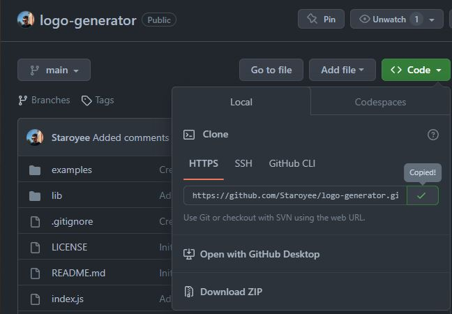
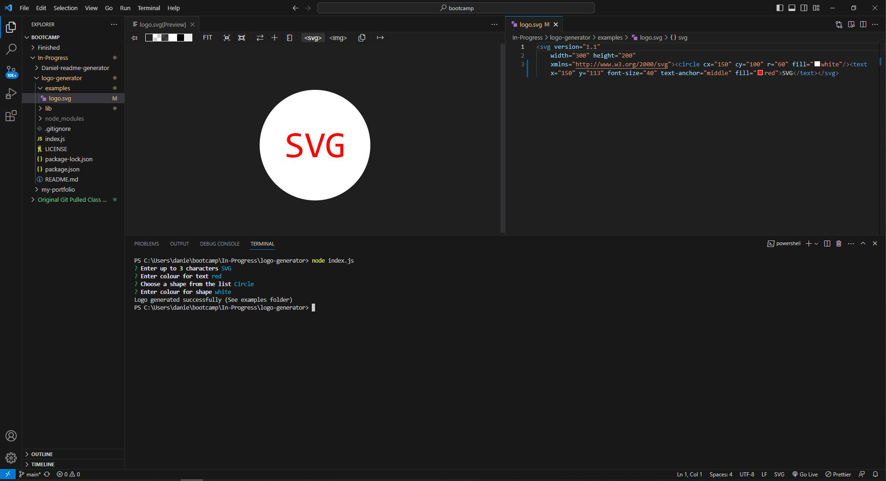

# logo-generator

## Description
I was tasked to create a command line application that would generate a logo using an svg file based off of user input.

I was motivated to undertake this task because I wished to gain a greater understanding of how node.js and npm modules can be used to create applications and how to implement testing to improve code functionality.

## Solve
The completion of this project provides the user with a functional command line application that allows the user to run the application, enter information when prompted and be provided with a .svg file containing a logo.

## I have learned:
* How to use JavaScript within node.js.
* How to install node modules using npm.
* How to use JavaScript to create a command line application.
* How to use object oriented programming, and imporing/exporting modules.
* How to use testing (jest).

## Installation
Steps to install this project on your local PC
1. Open the termal on your machine.
2. Use the terminal command `cd` to navigate to the directory where we want the repository located.
3. Locate the 'Code' button on the 'logo-generator' github repository, click it, then copy the 'HTTPS' link to clipboard. (See image)

4. Use the git command `git clone` followed by the URL copied from Github to clone the repo to our machine.
5. The `git clone` command creates a new directory with the same name as the repository. We navigate into our new directory using `cd`.
6. The repository should now be cloned onto your device and able to be edited in VScode or another editing software.
7. Install the NPM dependencies by opening the terminal in the index.js file and running the command 'npm i'.

## Instructions

To use the app:
1. Open index.js in the terminal and run 'node index.js'.
2. Follow through the prompts by entering the correct data.
3. Once successfully completed, open the 'examples' folder and view the generated logo.svg file.

## Screenshot

## Video
https://drive.google.com/file/d/1D4Jpegp0Tu42WdV6cKfpYyO8e_AvG1bX/view?usp=sharing

## Credits
* Week 9 activities
* Week 10 activities.
* https://developer.mozilla.org/en-US/docs/Web/JavaScript/Reference/Operators/Addition_assignment
* https://developer.mozilla.org/en-US/docs/Web/JavaScript/Reference/Classes
* https://jestjs.io/docs/getting-started
* https://www.npmjs.com/package/inquirer#documentation
* https://nodejs.org/api/fs.html
* https://nodejs.org/docs/latest-v18.x/api/
